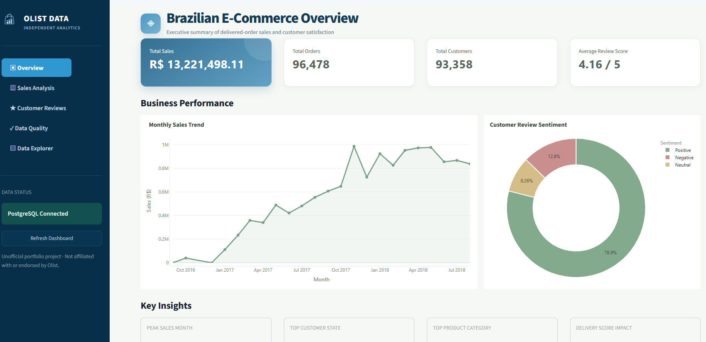
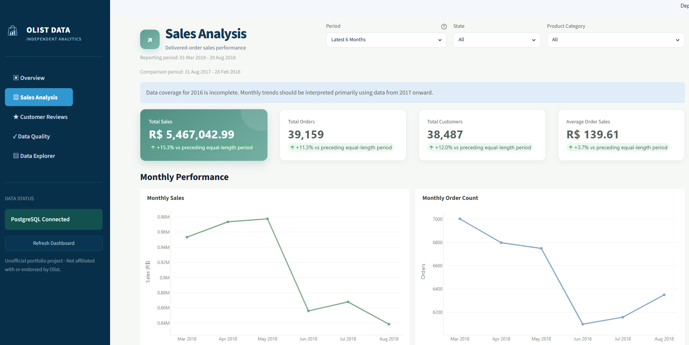
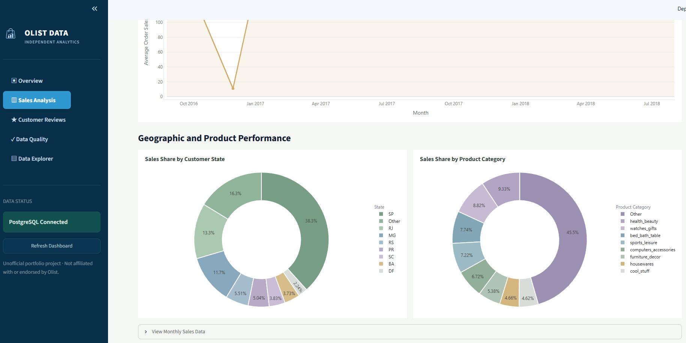
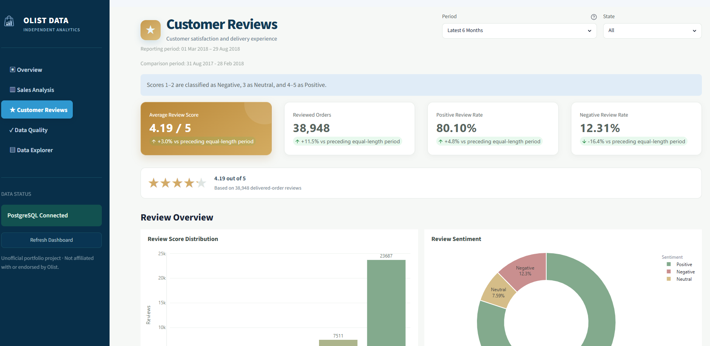
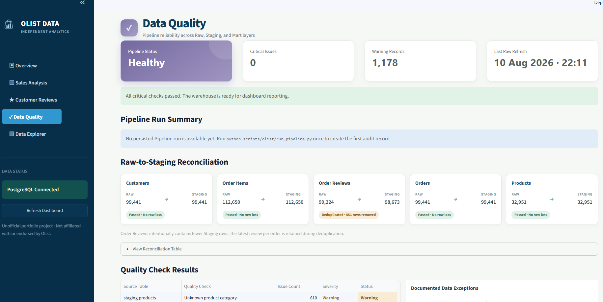
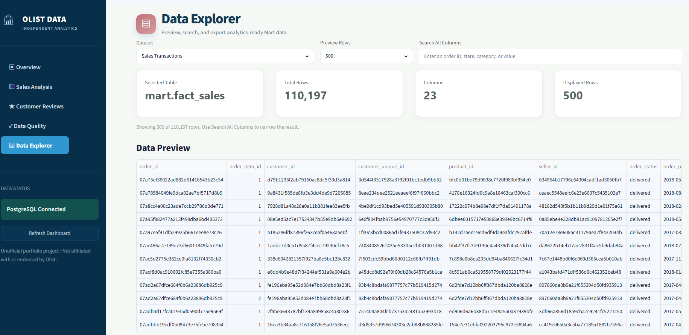

# Olist E-Commerce ETL and Analytics

[](https://github.com/yhong9/sales-etl-project/actions/workflows/tests.yml)
[](https://sales-etl-project-8jem7cpx5bel3cxurmssvz.streamlit.app/)
[](https://neon.com/)

An end-to-end portfolio project that loads the Brazilian E-Commerce Public
Dataset by Olist into PostgreSQL, validates and transforms the data, builds
analytics marts, and serves an interactive Streamlit dashboard.

**[Open the live analytics dashboard](https://sales-etl-project-8jem7cpx5bel3cxurmssvz.streamlit.app/)**

The first visit may take a few seconds while the hosted PostgreSQL compute and
Streamlit application wake from an idle state.

This is an independent educational project. It is not affiliated with,
sponsored by, or endorsed by Olist.

## Architecture

```text
Olist CSV files
      |
      v
PostgreSQL Raw
      |
      v
Typed and validated Staging
      |
      v
Sales and Review Marts
      |
      v
Streamlit Analytics Dashboard
```

The orchestrated pipeline contains 18 load, quality, transformation, and Mart
build steps. Pipeline executions are recorded in `audit.pipeline_runs` with
status, duration, completed steps, and failure information.

## Dashboard

The dashboard is deployed on Streamlit Community Cloud and queries the
analytics-ready Mart layer in Neon PostgreSQL.

- Executive overview with business insights and recommendations
- Sales analysis by period, state, and product category
- Customer review sentiment and delivery-performance analysis
- Data quality checks and Raw-to-Staging reconciliation
- Pipeline run monitoring
- Governed Mart data preview, search, and CSV export

## Dashboard Preview

### Executive Overview

The landing page summarizes delivered-order sales, order and customer volume,
review sentiment, monthly performance, and the most important business
findings.



<details>
<summary><strong>Sales Analysis</strong></summary>

Filterable KPIs compare the selected reporting period with the immediately
preceding equal-length period. Additional views show monthly performance and
the sales contribution of leading states and product categories.





</details>

<details>
<summary><strong>Customer Reviews</strong></summary>

Review KPIs, score distribution, sentiment, and delivery-performance analysis
connect customer satisfaction with operational outcomes.



</details>

<details>
<summary><strong>Data Quality</strong></summary>

Pipeline health, refresh information, documented exceptions, and
Raw-to-Staging reconciliation make transformation decisions visible and
auditable.



</details>

<details>
<summary><strong>Data Explorer</strong></summary>

Analytics-ready Mart tables can be selected, searched, previewed, and exported
without querying PostgreSQL manually.



</details>

## Data Quality

The project checks:

- Missing and duplicate business keys
- Invalid dates, prices, freight values, states, and review scores
- Unmatched customers, orders, and products
- Delivered orders with missing delivery results
- Unknown and untranslated product categories
- Multiple reviews for the same order
- Row-count reconciliation across warehouse layers

## Technology

- Python and pandas
- PostgreSQL
- SQLAlchemy and psycopg
- Streamlit
- Plotly
- pytest and pytest-cov
- GitHub Actions

## Testing and Continuous Integration

The automated test suite validates representative business rules across the
orders, customers, order items, products, and order reviews quality modules.
It covers cases such as invalid order statuses, malformed dates and customer
states, duplicate identifiers, negative prices, missing product categories,
invalid review scores, and unmatched foreign keys.

A PostgreSQL integration test exercises the review Staging transformation
against an isolated database and verifies that multiple reviews for one order
are reduced to the latest review. The test includes a database-name safety
check before creating or removing schemas.

GitHub Actions runs two independent jobs on pushes and pull requests to
`main`:

- Unit tests with a terminal coverage report
- A database integration test using a temporary PostgreSQL 18 service

Run the unit suite locally:

```powershell
python -m pytest -m "not integration" --cov=scripts/olist --cov-report=term-missing -v -p no:cacheprovider
```

Local integration tests are skipped by default because they require a
dedicated database named `olist_test`. The CI workflow provisions that
isolated database automatically.

## Project Structure

```text
sales-etl-project/
|-- .streamlit/
|   `-- config.toml
|-- dashboard/
|   |-- assets/
|   `-- olist_app.py
|-- data/
|   `-- archive/                 # Local source CSV files; ignored by Git
|-- scripts/
|   `-- olist/
|       |-- load_raw_*.py
|       |-- quality_raw_*.py
|       |-- build_staging_*.py
|       |-- build_fact_sales.py
|       |-- build_sales_marts.py
|       |-- build_review_marts.py
|       `-- run_pipeline.py
|-- tests/
|   |-- integration/
|   `-- test_quality_raw_*.py
|-- .github/workflows/tests.yml
|-- .env.example
|-- requirements-dev.txt
|-- requirements.txt
`-- README.md
```

## Local Setup

1. Create and activate a virtual environment.

2. Install dependencies:

   ```powershell
   python -m pip install -r requirements.txt
   ```

3. Create a PostgreSQL database named `olist_warehouse`, then create these
   schemas:

   ```sql
   CREATE SCHEMA IF NOT EXISTS raw;
   CREATE SCHEMA IF NOT EXISTS staging;
   CREATE SCHEMA IF NOT EXISTS mart;
   ```

4. Copy `.env.example` to `.env` and enter the local PostgreSQL credentials.
   Never commit `.env`.

5. Place the Olist CSV files in `data/archive/`. The source data is not stored
   in this repository.

6. Run the complete pipeline:

   ```powershell
   python scripts/olist/run_pipeline.py
   ```

7. Start the dashboard from the project root:

   ```powershell
   python -m streamlit run dashboard/olist_app.py
   ```

## Important Metric Definitions

- Sales includes product price and excludes freight unless explicitly labeled
  as transaction value.
- Sales reporting uses delivered orders.
- Average order sales equals product sales divided by distinct orders.
- Customers are counted with `customer_unique_id`.
- Reviews 1-2 are Negative, 3 is Neutral, and 4-5 are Positive.
- Late delivery means the actual customer delivery date is after the estimated
  delivery date.

## Data Limitations

Data coverage for 2016 is incomplete. The dashboard prevents KPI comparisons
when the comparison period is not fully represented in the dataset.

## Future Improvements

- Add incremental and idempotent loading instead of rebuilding every layer
- Expand PostgreSQL integration coverage across additional Staging and Mart
  transformations
- Add step-level row counts and data-quality results to the pipeline audit
  tables
- Introduce scheduled pipeline execution and alerting for failed runs
- Add dimensional date, customer, product, and geography models for broader BI
  use cases
